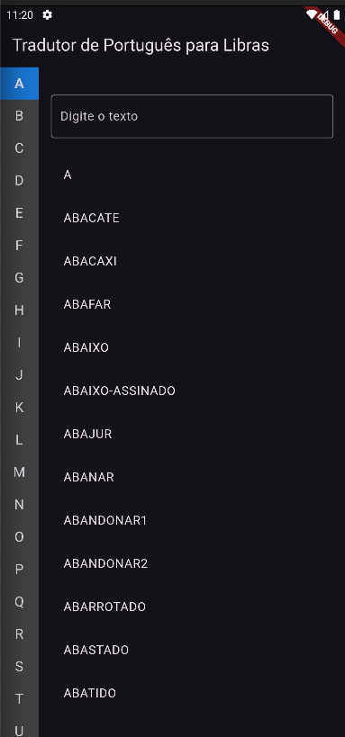
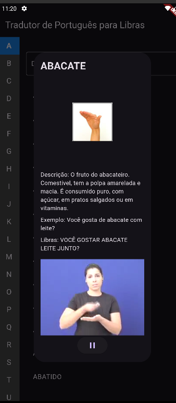
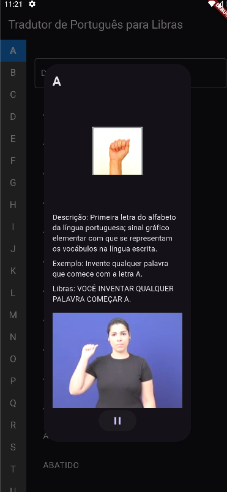

## Funcionalidades Principais

1. Pesquisa de palavras em português
2. Filtragem de palavras por letra inicial
3. Exibição de detalhes da palavra, incluindo:
   - Descrição
   - Exemplo de uso
   - Tradução em Libras
   - Imagem ilustrativa do sinal
   - Vídeo demonstrativo do sinal (quando disponível)

## Tecnologias Utilizadas

- **Flutter**: Framework de desenvolvimento multiplataforma para criação de aplicativos móveis.
- **Dart**: Linguagem de programação utilizada com o Flutter.
- **JSON**: Formato de dados utilizado para armazenar informações sobre palavras e sinais.
- **Bibliotecas Flutter**:
  - `cached_network_image`: Para carregamento e cache eficiente de imagens da web.
  - `http`: Para realizar requisições HTTP.
  - `video_player`: Para reprodução de vídeos demonstrativos dos sinais.

## Estrutura do Projeto

- `lib/`: Contém o código-fonte principal do aplicativo.
  - `main.dart`: Ponto de entrada do aplicativo.
  - Componentes principais:
    - `TradutorScreen`: Tela principal do tradutor.
    - `VideoPlayerWidget`: Widget personalizado para reprodução de vídeos.
- `assets/`: Contém arquivos de dados e recursos.

  - `palavras.json`: Base de dados de palavras e suas traduções (baseada no dicionário do INES).
  - `mao.json`: Mapeamento de IDs para imagens de sinais (baseada no dicionário do INES).

## Configuração e Execução

1. Execute `flutter pub get` para instalar as dependências.
2. Execute `flutter run` para iniciar o aplicativo em um emulador ou dispositivo conectado.
3. Para rodar o app em modo web, execute `flutter run -d edge --web-browser-flag "--disable-web-security"`

## Screenshots

Aqui estão algumas capturas de tela do aplicativo em funcionamento:

  
  
  

